# Electronic medicine card 
## About project
>Electronic medicine card is a system consisting of cross-platform web and mobile applications.

It helps centralize data, takes the paperwork out of doctors, compliance with uniform standards of document circulation. Users access service through the website interface. There are 7 types of roles: admin, patient, family doctor, doctor specialist, nurse, main doctor and laboratory assistant. In this HIS (Hospital Information System) patient, family doctor, doctor specialist, nurse, main doctor and laboratory assistant can interact with each other. 

Also patient have symptoms mobile app where he can make chronology of symptoms (as a result doctor will have more data for diagnosis).

Project created using design pattern MVC and OOP principles. 

## Project use:
* Java on framework Spring Boot
* Spring Security
* Hibernate
* Lombok
* Maven
* Maria DB
* Tomcat
* HTML
* CSS
* JavaScript
* Bootstrap

## Diagrams:
* [UseCase](https://drive.google.com/file/d/1Ln7L0-wHYgPsyu3IZJs2-XCHmE3JU6VW/view?usp=sharing)
* [State Chart](https://drive.google.com/file/d/1VIpuczf_BJ3nXjIRfW-8OQyGwrpPAnPX/view?usp=sharing)
* [Database](https://drive.google.com/file/d/1f7f6KTtPT7f_X6OTF2PZFO4N0OGbzIKm/view?usp=sharing)
* [Deployment](https://drive.google.com/file/d/1-qLb4mB_VwrxrVzBBMXO4aBFuOvqKfGM/view?usp=sharing)

## Screenshots:

### Medicine card:
#### Visits: 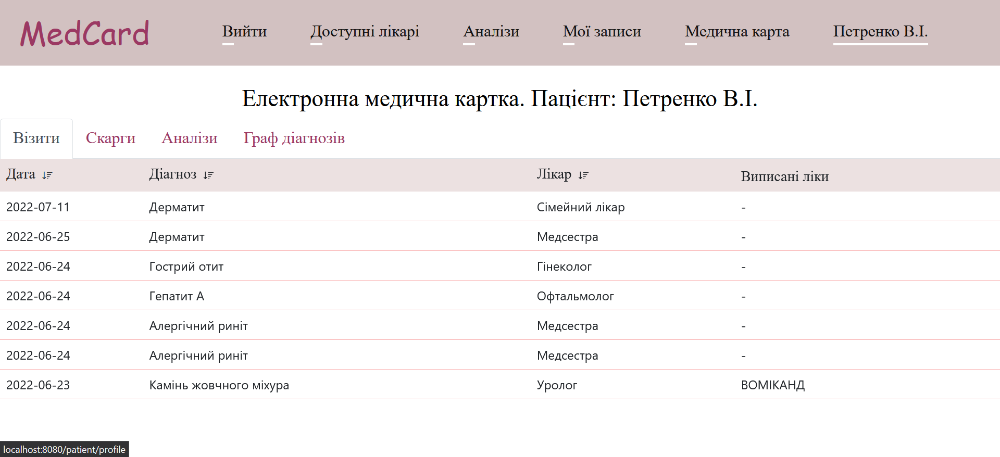
#### Symptoms (patient add symptoms at [Symptoms Mobile App](https://github.com/MrGold6/symptomsApp)): 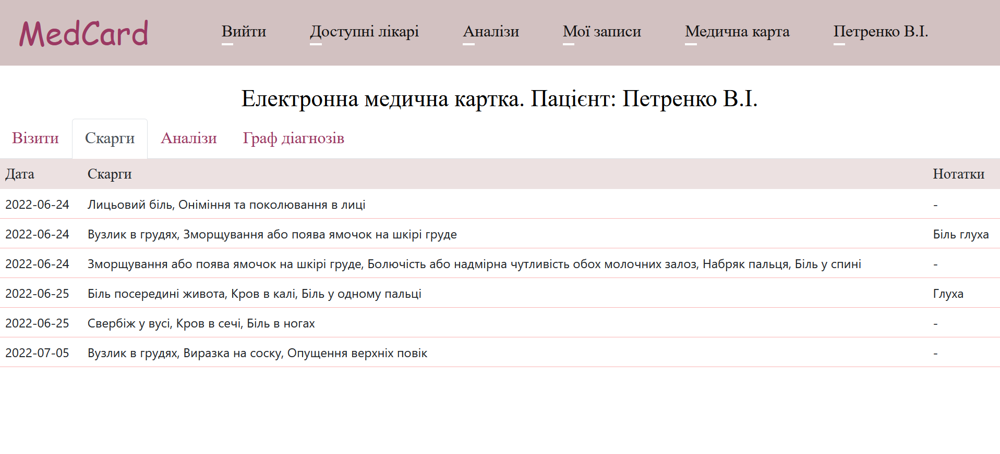
#### Graph of diagnoses: 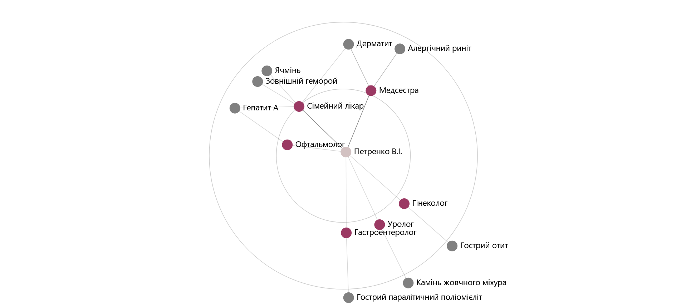

### Patient interface:
#### List of available doctors: 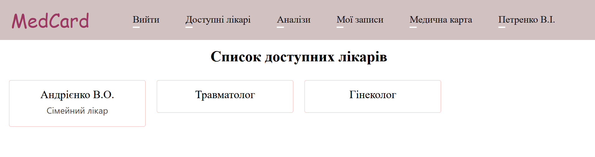
#### Doctor's info: 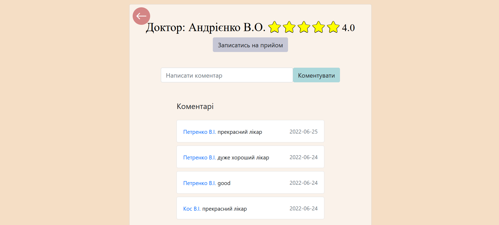
#### Doctor's schedule: 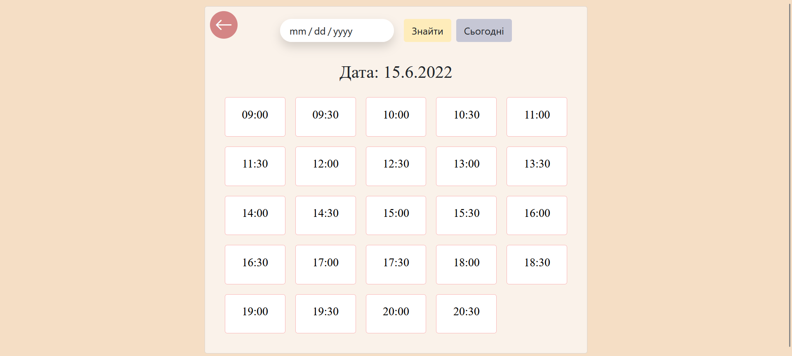
#### Records of the patient to the doctor: 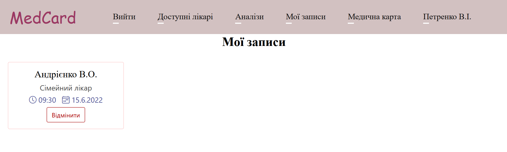

### Main doctor interface:
#### Disease infographic: 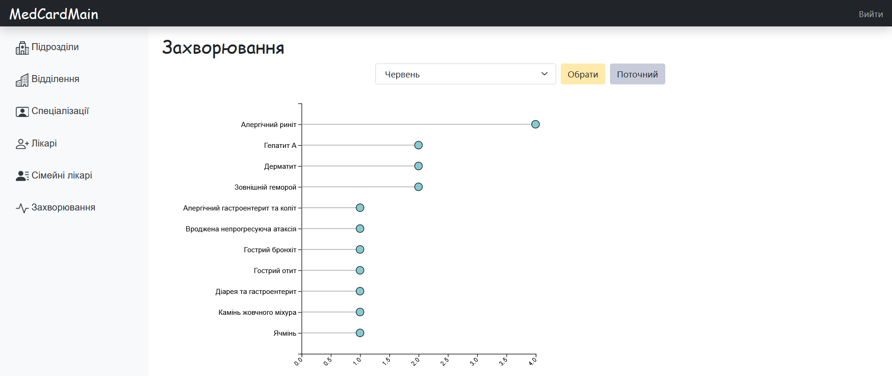
#### Doctor infographic: 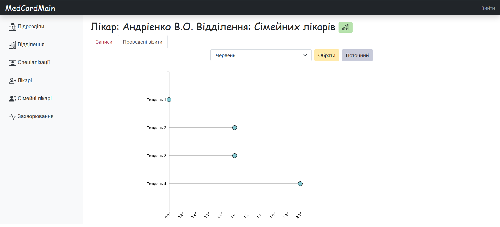
#### List of all doctors: 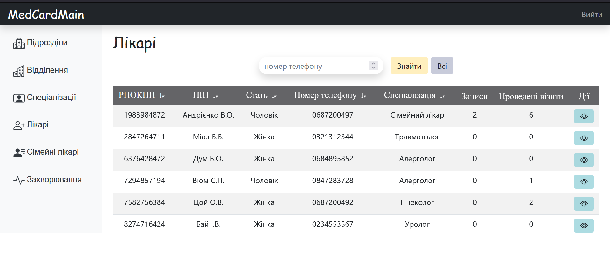
#### Department's CRUD: 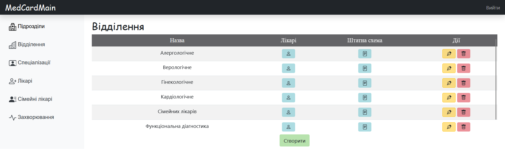

### Family doctor interface:
#### List of all patients: 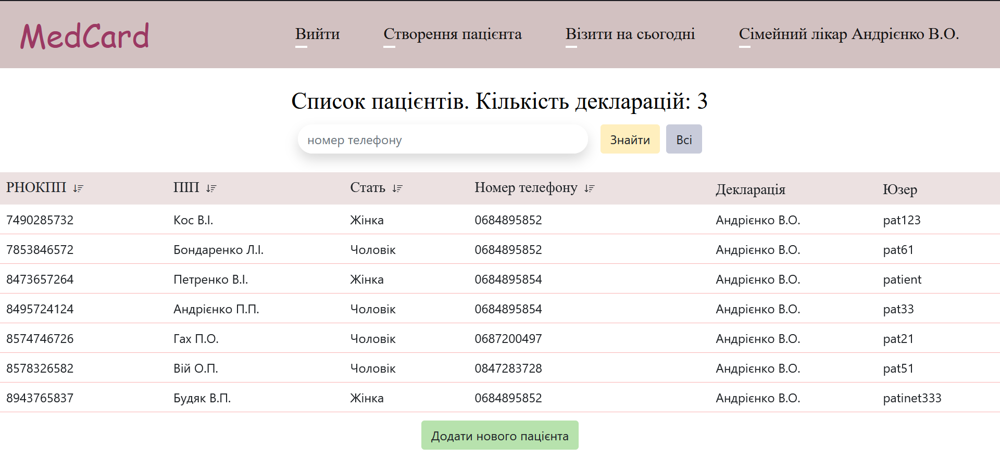
#### List of records to doctor: 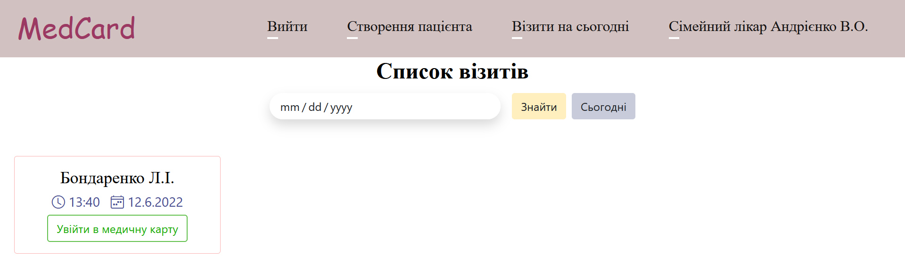
#### Create visit: 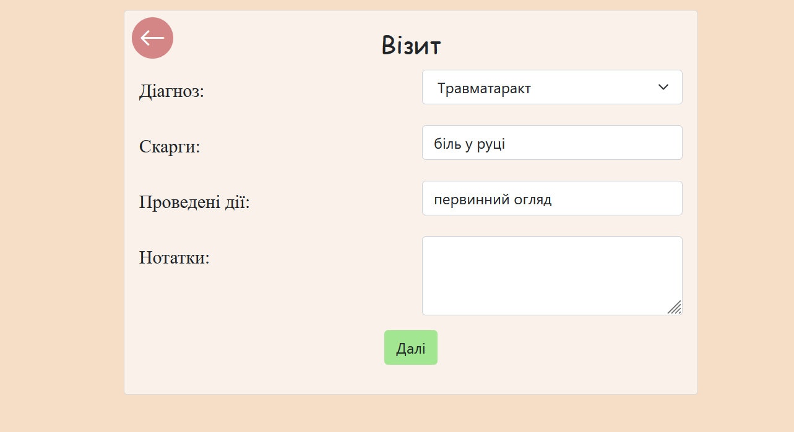

### Admin interface:
#### List of all users (CRUD):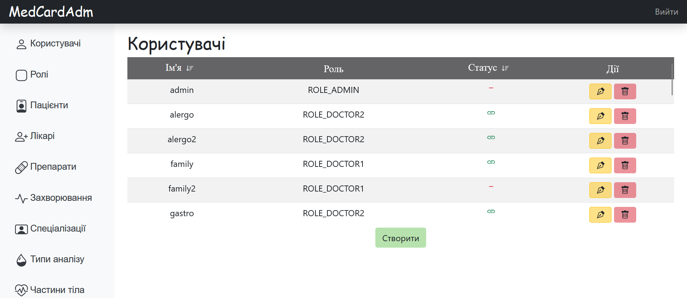
#### List of all patients (CRUD): 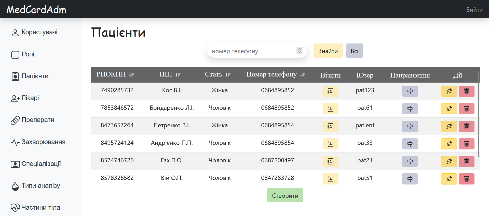
 

